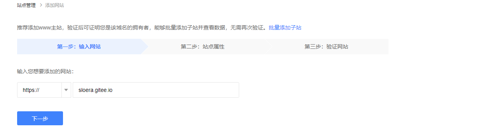

包括next主题下载、常规配置文件修改
<!-- more -->

# 主题安装

## 下载主题

```sh
$ cd hexo
$ git clone https://github.com/theme-next/hexo-theme-next themes/next
```
## 使用next

修改站点配置文件`_config.yml`文件。

```yaml
theme: next
```

# 个性化配置

## 添加RSS订阅

<https://github.com/hexojs/hexo-generator-feed>

1. 下载依赖

   ```sh
   cnpm install hexo-generator-feed --save
   ```
   
2. 站点配置文件，

   ```yml
   feed:
     type: 
       - atom
       - rss2
     path: 
       - atom.xml
       - rss2.xml
     limit: 20
     hub:
     content:
     content_limit: 140
     content_limit_delim: ' '
     order_by: -date
     icon: icon.png
     autodiscovery: true
     template:
   ```
   
3. 主题配置文件

   ```yaml
   follow_me:
     # Twitter: https://twitter.com/username || twitter
     # Telegram: https://t.me/channel_name || telegram
     # WeChat: /images/wechat_channel.jpg || wechat
     RSS: /rss2.xml || rss
     ATOM: /atom.xml || rss
   ```

## 设置动态背景

### canvas nest

<https://github.com/hustcc/canvas-nest.js/blob/master/README-zh.md>

1. 下载依赖

   ```sh
   cd themes/next/
   git clone https://github.com/theme-next/theme-next-canvas-nest source/lib/canvas-nest
   ```

2. 主题配置文件`_config.yml`

   ```yml
   canvas_nest:
     enable: true
   ```

## 添加顶部加载条

<https://github.com/theme-next/theme-next-pace>

1. 下载依赖

   ```sh
   cd themes/next/
   git clone https://github.com/theme-next/theme-next-pace source/lib/pace
   ```

2. 主题配置文件`_config.yml`

   ```yml
   pace:
     enable: true
     # Themes list:
     # big-counter | bounce | barber-shop | center-atom | center-circle | center-radar | center-simple
     # corner-indicator | fill-left | flat-top | flash | loading-bar | mac-osx | material | minimal
     theme: minimal
   ```

## 设置博文内链接为蓝色

修改`themes\next\source\css\_common\components\post\post.styl`。

在文件最后添加

```styl
.post-body p a{
  color: #0593d3;
  border-bottom: none;
  &:hover {
    color: #0477ab;
    text-decoration: underline;
  }
}
```

## ~~显示文章字数和阅读时长~~

1. 安装依赖

   ```sh
   cnpm install hexo-wordcount --save
   ```

2. 修改站点配置文件

   ```yaml
   symbols_count_time:
     symbols: true                # 文章字数统计
     time: true                   # 文章阅读时长
     total_symbols: true          # 站点总字数统计
     total_time: true             # 站点总阅读时长
     exclude_codeblock: false     # 排除代码字数统计
   ```

## 文章末尾添加版权说明

修改主题配置文件`themes\next\_config.yml`

```yaml
creative_commons:
  license: by-nc-sa
  sidebar: false
  post: true  # 将false改为true即可显示版权信息
  language:
```

## 忽略要编译的文件

站点配置文件中，`skip_render`配置项可以设置忽略文档清单。只有source目录下的文件才会发布到public（能够在网络上访问到），`skip_render`参数设置的路径是相对于source目录的路径。

```yaml
skip_render: [README.md]          # 忽略文档清单
```

## 搜索

1. 安装依赖

   ```sh
   cnpm install hexo-generator-searchdb
   cnpm install hexo-generator-search
   ```

2. 站点配置文件

   ```yaml
   search:
     path: search.xml
     field: post
     content: true
     format: html
   ```

3. 主题配置文件

   ```yaml
   local_search:
     enable: true
   ```

## 搜索引擎收录

### 生成站点地图

百度和Google的站点地图生成插件

```sh
cnpm install hexo-generator-baidu-sitemap --save
cnpm install hexo-generator-sitemap --save
```

### 站点配置文件

```yaml
# 站点地图
# 自动生成sitemap
sitemap:
  path: sitemap.xml
baidusitemap:
  path: baidusitemap.xml
```

### 百度站长平台设置

<https://ziyuan.baidu.com/site/index>

在`用户中心/站点管理`添加一个新的网站



选择站点属性后进行`验证网站`

下载验证文件放置到`themes\next\source`目录下

```sh
hexo clean;hexo g -d;
#gitee上更新部署后，点击完成验证
```

### 链接主动提交

1. 安装依赖

   ```sh
   npm install hexo-baidu-url-submit --save
   ```

2. 站点配置文件

   ```yaml
   #主动推送
   baidu_url_submit:
     count: 5 ## 提交最新的五个链接
     host: sloera.gitee.io ## 百度站长平台中注册的域名
     token: your_token  ## 准入秘钥
     path: baidu_urls.txt ## 文本文档的地址， 新链接会保存在此文本文档里
   ```

   加入新的deployer

   ```yaml
   deploy:
   - type: git
     repo: git@gitee.com:sloera/sloera.git
     branch: master
   - type: baidu_url_submitter ## 添加这里内容即可
   ```

插件会在public根目录下生成`baidu_urls.txt`文件，当执行`hexo d(hexo g -d等同)`时，会自动提交到git和百度站点。

## 图片点击放大查看

1. 安装依赖

   ```sh
   cd themes/next/
   git clone theme-next/theme-next-fancybox3 source/lib/fancybox
   ```

2. 主题配置文件

   ```yaml
   fancybox: true
   ```

# 参考链接

> <https://zhuanlan.zhihu.com/p/106060640>
>
> <https://www.jianshu.com/p/f8ec422ebd52>