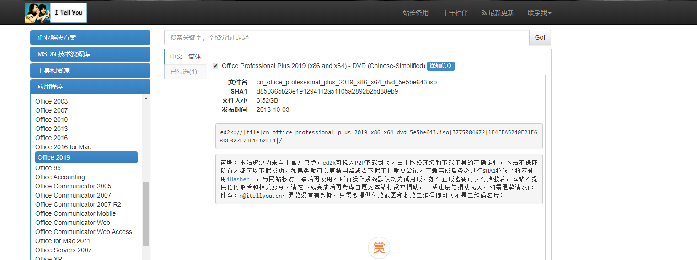

## 准备

### office

1. 在网站下载office安装包。



`ed2k`链接使用迅雷工具进行下载。

2. ~~~~

   ~~用于选择安装哪些组件，避免全家桶。~~
   
   默认安装所有组件。
   
3. 下载office镜像包后，用解压工具解压，运行`Setup.exe`程序，安装所有组件。

### 激活

可使用[亦是美](http://www.yishimei.cn/network/319.html)激活

## 邮箱设置

以下操作，除过outlook邮箱，都是新建的时候选择`IMAP`设置

### qq邮箱设置

```yaml
接收邮件:
	服务器: imap.qq.com
	端口号: 993
	加密方法: SSL/TLS
发送邮件:
	服务器: smtp.qq.com
	端口号: 465
	加密方法: SSL/TLS
密码: 邮箱授权码
```

### 163邮箱

```yaml
接收邮件:
	服务器: imap.163.com
	端口号: 993
	加密方法: SSL/TLS
发送邮件:
	服务器: smtp.163.com
	端口号: 465
	加密方法: SSL/TLS
密码: 邮箱授权码
```

如果是2016及以前的outlook版本。

需要点击其他设置，打开`Internet 电子邮件设置>发送服务器`，选中`我的发送服务器(SMTP)要求验证`，再勾选`使用与接收邮件服务器相同的设置`

